# 🚢 Sagar Netra

## 🇮🇳 AI-Powered Maritime Oil Spill Monitoring & Investigation Platform

> **Detect. Trace. Investigate. Protect.**

Sagar Netra is an AI-powered maritime intelligence prototype developed for the **Smart India Hackathon (SIH) 2026**.

The platform combines **Sentinel-1 SAR satellite imagery, AI-based oil-spill detection, geospatial analysis, wind/current data, and AIS vessel intelligence** to help maritime authorities detect oil spills and investigate their probable source.

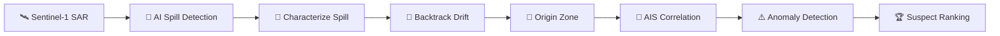

The objective is to move from _"a spill was detected"_ to _"where did it probably originate, which vessels were relevant, and why?"_

---

## 🎯 Problem

Oil spills in offshore waters can be difficult to detect and investigate because:

- Large maritime areas are difficult to monitor continuously.
- Oil slicks can be confused with natural ocean features.
- The original release location may differ from the visible slick location.
- Vessel movements must be correlated with environmental conditions.
- AIS data can contain gaps or suspicious behavior.
- Manual investigation can be slow and resource-intensive.

Sagar Netra addresses these challenges by connecting satellite observations with AI, environmental data, and vessel intelligence.

---

## ⭐ Key Features

- **Satellite Monitoring** — Sentinel-1 SAR observations for selected maritime areas.
- **AI Spill Detection** — classifies the observed region as oil / no-oil.
- **Spill Characterization** — estimates area, geometry and confidence.
- **Hindsight Drift Analysis** — uses wind/current information to backtrack the slick.
- **AIS Filtering** — narrows regional vessel traffic using spatial-temporal overlap.
- **AIS Anomaly Detection** — highlights suspicious gaps and movement changes.
- **Explainable Ranking** — provides an attribution/suspicion score with reasons.
- **Risk Prediction** — projects possible future coastal impact.
- **Interactive Investigation UI** — map, timeline, vessel analysis and evidence views.

> **Prototype note:** the SIH demo uses controlled scenarios/data for deterministic judging, while the satellite integration demonstrates the real Sentinel Hub acquisition path.

---

## 🔄 Core Workflow

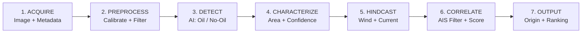

### End-to-End Intelligence Flow

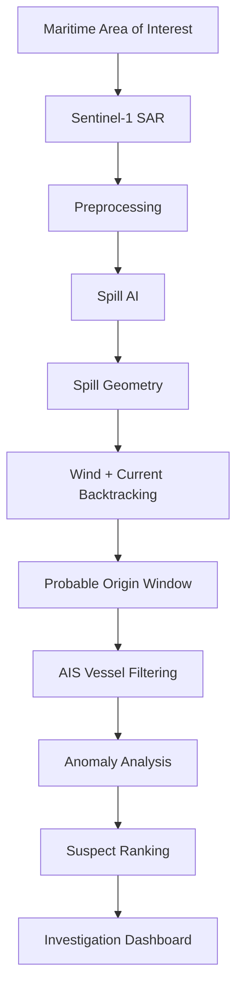

---

## 🏗️ System Architecture

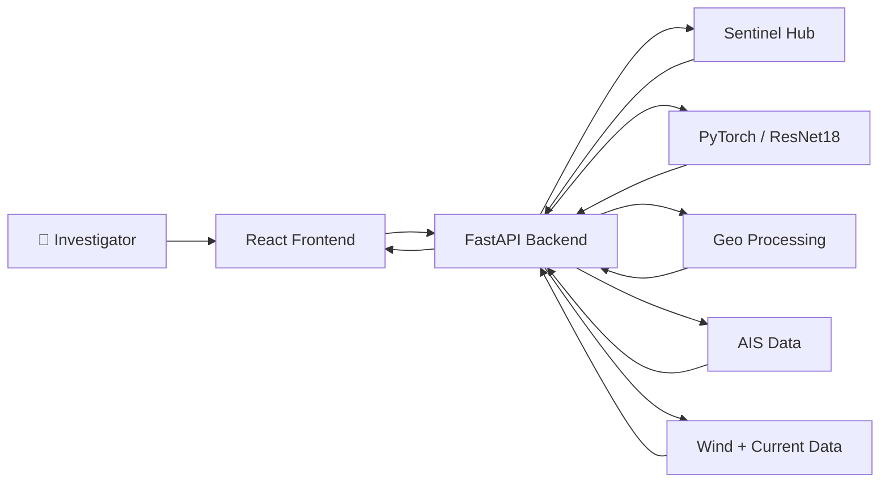

### Main Layers

| Layer         | Responsibility                                                  |
| ------------- | --------------------------------------------------------------- |
| Frontend      | Monitoring, investigation, maps, timelines and visual analytics |
| Backend       | APIs, Sentinel Hub requests and processing orchestration        |
| AI/ML         | Oil-spill classification/detection                              |
| Geospatial    | Spill geometry, coordinates and spatial correlation             |
| External Data | Sentinel-1, AIS, wind and current observations                  |

---

## 🛰️ Satellite Data Pipeline

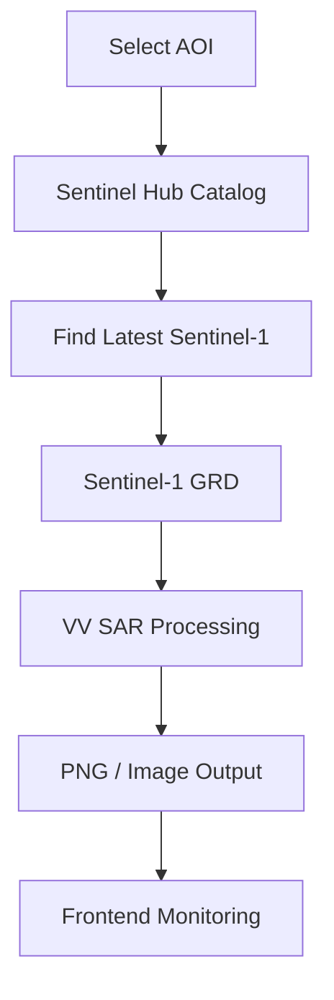

The backend searches the requested area for the latest compatible Sentinel-1 GRD observation and requests a processed VV image through Sentinel Hub.

Current processing uses:

- Sentinel-1 GRD
- IW acquisition mode
- VV polarization
- Orthorectification
- 1024 × 1024 output
- PNG response
- Linear-power input for the current Evalscript configuration

---

## 🤖 AI / ML Pipeline

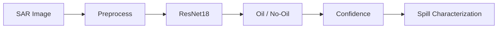

The prototype uses PyTorch + ResNet18 for the spill-classification component. The ML result is then combined with the geospatial workflow rather than being treated as the complete investigation by itself.

---

## 🌊 Spill Investigation

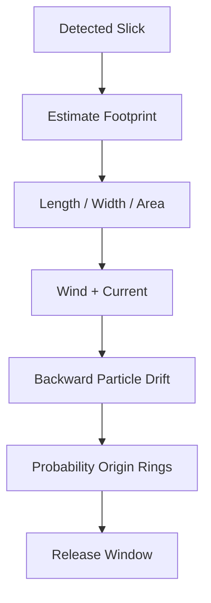

The investigation stage connects the observed spill location to a probable earlier release area. This matters because the current slick location may differ from the original release location due to environmental transport.

---

## 🚢 AIS Correlation

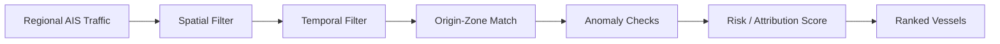

Example prototype funnel:

```
1,248 vessels
      ↓
   86 candidates
      ↓
   21 candidates
      ↓
    8 candidates
      ↓
    3 suspects
```

The ranking can consider:

- Presence in the origin zone
- Timing overlap
- Course changes
- Speed changes
- AIS transmission gaps
- Spatial-temporal consistency

---

## ⚠️ AIS Blackout Analysis

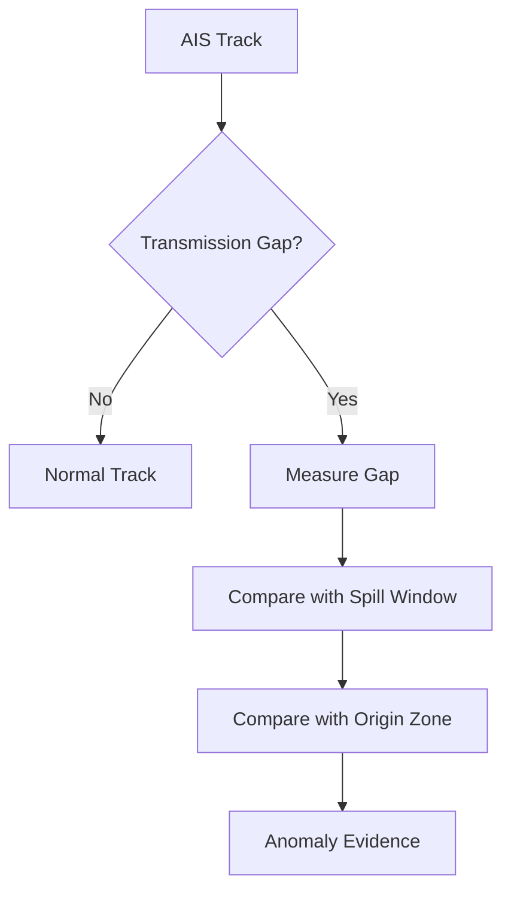

The prototype demonstrates a case where a vessel's AIS transmission gap overlaps the suspected discharge period and origin area.

> **Important:** an AIS gap is treated as an investigative signal, not automatic proof of illegal discharge.

---

## 🗺️ Risk Prediction

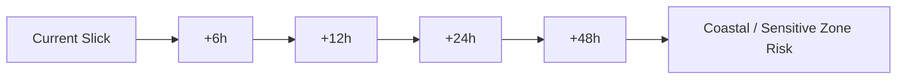

The demo can show projected impact toward sensitive coastal areas using the available wind/current scenario.

---

## 🖥️ Frontend

### Main navigation

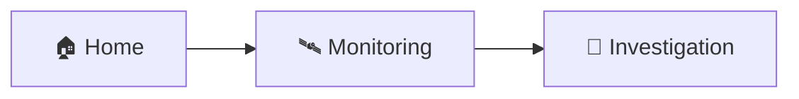

The current prototype keeps the main workflow focused on **Home**, **Monitoring**, and **Investigation**. The previously planned Reports/History pages are not required for the core SIH demo workflow and can remain outside the main navigation.

---

## 🎬 SIH Demo Flow

### Scenario A — Normal Patrol / No Spill

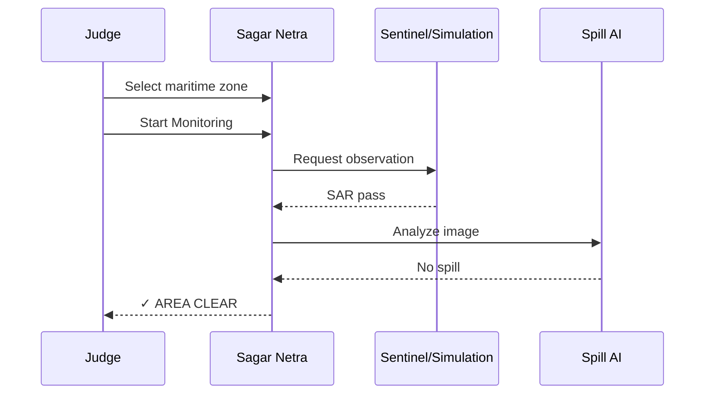

**Demo steps:**

1. Open Monitoring.
2. Select a maritime zone such as West Coast Zone 1.
3. Start monitoring.
4. Use the demo control for **No Spill / Clear**.
5. Show the scan/processing sequence.
6. Finish on the **AREA CLEAR** result.

### Scenario B — Spill Trace Investigation

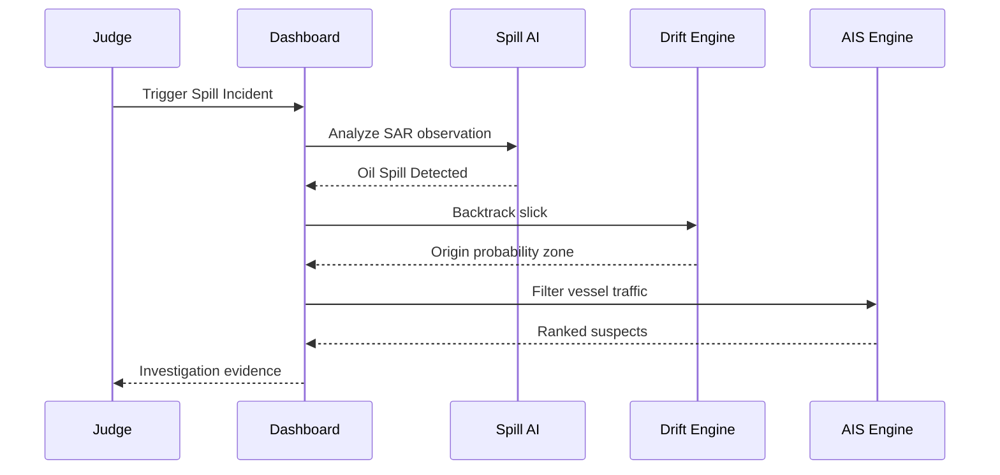

**Recommended judging sequence:**

1. Trigger **Spill Incident**.
2. Show the SAR scan.
3. Show **OIL SPILL DETECTED**.
4. Enter Investigation Mode.
5. Show the drift/backtracking map.
6. Show the probability-origin zone.
7. Show the AIS filtering funnel.
8. Open the top-ranked vessel.
9. Show its AIS anomaly / blackout timeline.
10. Open Risk Prediction.
11. Move the timeline toward +48h.
12. Explain the potential coastal impact.

---

## 🛠️ Technology Stack

| Category           | Technology                      |
| ------------------ | ------------------------------- |
| Frontend           | React 18 + Vite + TypeScript    |
| Styling            | Tailwind CSS                    |
| Icons              | Lucide React                    |
| Mapping            | Leaflet                         |
| Backend            | Python + FastAPI                |
| AI / ML            | PyTorch + ResNet18              |
| Satellite          | Sentinel-1 SAR + Sentinel Hub   |
| Geo Data           | GeoJSON / geospatial processing |
| Maritime Data      | AIS                             |
| Environmental Data | Wind + Current                  |
| Version Control    | Git + GitHub                    |

---

## 📁 Project Structure

```
SIH/
│
├── frontend/
│   ├── src/
│   │   ├── components/
│   │   ├── context/
│   │   ├── data/
│   │   └── pages/
│   │       ├── Home.tsx
│   │       ├── LiveMonitoring.tsx
│   │       └── Investigation.tsx
│   ├── package.json
│   ├── vite.config.ts
│   └── tailwind.config.js
│
├── backend/
│   ├── main.py
│   ├── ...
│   └── .env
│
├── ml/
│   └── ...
│
├── kaggle/
│   └── ...
│
├── cache/
│   └── ...
│
├── .gitignore
└── README.md
```

Do not commit `node_modules`, `.env`, model binaries, caches or other generated/private files.

---

## 💻 Requirements

Install:

- Node.js (LTS recommended)
- Python 3.10+
- Git

Check installation:

```bash
node --version
npm --version
python --version
git --version
```

---

## 📦 Installation

### 1. Clone the repository

```bash
git clone <YOUR_GITHUB_REPOSITORY_URL>
cd SIH
```

### 2. Frontend dependencies

```bash
cd frontend
npm install
```

### 3. Backend environment

Open a second terminal:

```bash
cd SIH/backend
```

Create a virtual environment.

**Windows:**

```bash
python -m venv venv
venv\Scripts\activate
```

**macOS / Linux:**

```bash
python3 -m venv venv
source venv/bin/activate
```

Install backend packages:

```bash
pip install -r requirements.txt
```

If the project does not contain `requirements.txt`, install the packages currently used by the backend, including FastAPI, Uvicorn, HTTPX and python-dotenv.

---

## 🔐 Sentinel Hub Configuration

Create `backend/.env` and add:

```
SENTINEL_CLIENT_ID=your_client_id
SENTINEL_CLIENT_SECRET=your_client_secret
```

Keep these credentials private.

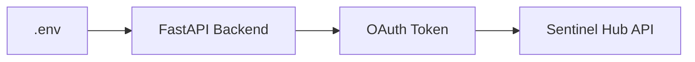

Never put Sentinel credentials directly inside frontend code or commit `.env` to GitHub.

---

## ▶️ Start the Application

The prototype normally uses two servers.

**Terminal 1 — Backend**

```bash
cd SIH/backend
# activate the virtual environment, then:
uvicorn main:app --reload
```

The backend will normally be available at `http://127.0.0.1:8000`. If `main.py` exposes a different app/module path, use that existing path instead.

**Terminal 2 — Frontend**

```bash
cd SIH/frontend
npm run dev
```

Vite will normally provide `http://localhost:5173`. Open that address in the browser.

### Runtime Flow

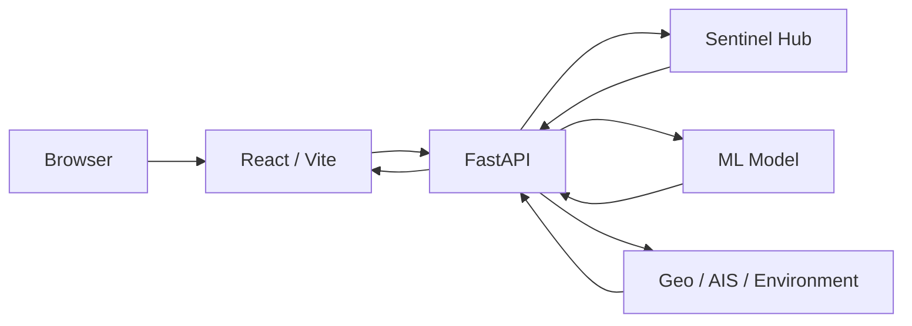

For the SIH presentation, keep both frontend and backend running before starting the demo.

---

## 🧪 Before the Demo

- [ ] Backend starts without errors
- [ ] Frontend starts without errors
- [ ] Sentinel credentials are loaded
- [ ] Monitoring page opens
- [ ] Map loads correctly
- [ ] Scenario A works
- [ ] Scenario B works
- [ ] Investigation page works
- [ ] AIS ranking appears
- [ ] Risk prediction works
- [ ] No private keys are exposed

---

## 🚀 GitHub Setup

From the project root:

```bash
git init
git add .
git commit -m "Initial Sagar Netra prototype"
```

Connect your GitHub repository:

```bash
git remote add origin <YOUR_GITHUB_REPOSITORY_URL>
git branch -M main
git push -u origin main
```

Check:

```bash
git status
git remote -v
```

### Recommended `.gitignore`

```
node_modules/
venv/
__pycache__/
.env
*.pyc
.cache/
cache/
dist/
build/
```

Do not upload: `.env`, Sentinel Hub secrets, `node_modules/`, the Python virtual environment, large generated caches, private datasets, or large model files unless intentionally required.

---

## ⚡ Prototype vs Production

Sagar Netra is currently an SIH demonstration prototype.

**Prototype**

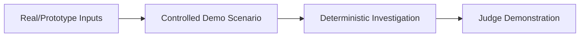

**Production vision**

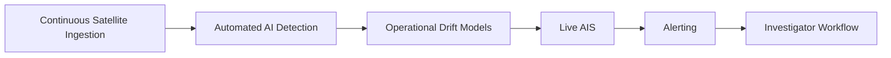

The prototype demonstrates the architecture and intelligence workflow without claiming that every component is already an operational national-scale surveillance system.

---

## ⚠️ Important Limitations

- Sentinel observations are not continuously available for every location.
- Satellite acquisition depends on satellite revisit and data availability.
- AIS coverage and transmission quality vary.
- Environmental drift modelling depends on the quality and resolution of wind/current inputs.
- AI confidence should not be interpreted as legal proof.
- A vessel ranking identifies candidates for investigation; it does not establish guilt.
- Real operational deployment would require validated datasets, stronger uncertainty modelling, security controls and domain validation.

---

## 🔮 Future Scope

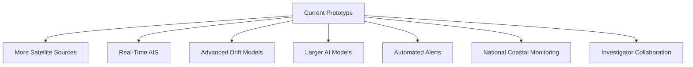

Potential extensions:

- Multi-satellite fusion
- Near-real-time ingestion
- Improved oil-spill segmentation
- Ensemble wind/current forecasting
- Vessel behaviour anomaly models
- Automated alert prioritization
- Historical incident analytics
- Secure evidence management
- National-scale coastal monitoring

---

## 🌱 Expected Impact

**Environmental**

- Faster spill awareness
- Earlier response
- Reduced spread and ecosystem damage
- Better monitoring of sensitive coastal areas

**Investigation**

- Faster identification of relevant vessels
- Evidence-based prioritization
- Reduced manual AIS screening
- Spatial-temporal investigation support

**Operational**

- Scalable monitoring of large offshore areas
- Unified satellite, AIS and environmental information
- Faster transition from detection to investigation

---

## 🏆 SIH Presentation Story

> "We are not only detecting an oil spill. We are connecting the spill to its probable origin and then correlating that origin with vessel behaviour."

**30-second architecture explanation:**

```
Satellite → AI Detection → Spill Characterization → Drift Backtracking
→ Origin Probability → AIS Correlation → Anomaly Detection
→ Suspect Ranking → Investigator
```

**Key differentiation:** detection alone tells authorities WHERE the spill is. Sagar Netra aims to help explain WHERE it likely came from and WHICH vessels deserve investigation.

---

## 🇮🇳 Why Sagar Netra?

India has a long coastline, major ports, offshore energy infrastructure and environmentally sensitive marine ecosystems. A scalable maritime intelligence layer can help authorities combine **Satellite + AI + Ocean Dynamics + AIS + Geospatial Intelligence** into one investigation workflow.

Potential applications include Indian coastal surveillance, oil-spill response, maritime environmental protection, offshore infrastructure monitoring, vessel investigation, pollution accountability, and coastal ecosystem protection.

---

## 🏆 Smart India Hackathon

- **Project:** Sagar Netra
- **Domain:** Maritime / Environmental Intelligence
- **Hackathon:** Smart India Hackathon 2026
- **Core Objective:** Build an intelligent system capable of detecting maritime oil spills from satellite observations, tracing their probable origin, correlating vessel activity, and supporting evidence-based investigation.

## 👥 Team

**Team:** Straw Hats Pirates

Developed for Smart India Hackathon 2026.

---

## 📜 Project Motto

**Detect. Trace. Investigate. Protect.**

🇮🇳 _Sagar Netra — Intelligent Eyes for India's Maritime Domain._
